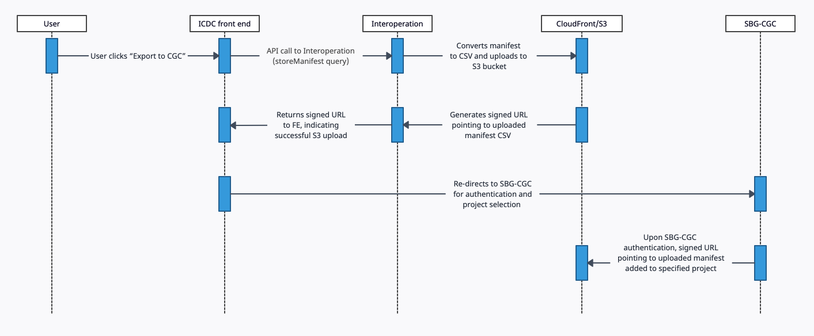

# bento-icdc-interoperation

This microservice supports interoperability between the ICDC and other nodes in the CRDC via publicly-available APIs. It identifies ICDC-relevant data in the CRDC nodes, maps the data to corresponding ICDC studies and provides an API for the ICDC front-end to retrieve information about the available data, including how to access it. Currently, the microservice searches for and returns relevant image collection data from the IDC and TCIA CRDC nodes; however, with minor updates, the number of CRDC nodes examined can easily be expanded as the need arises.

&nbsp;

## Interoperation process overview



&nbsp;

## Data available from CRDC nodes

| CRDC Node |                                                    Response data fields                                                    |
| :-------: | :------------------------------------------------------------------------------------------------------------------------: |
|    IDC    | collection_id, cancer_type, date_updated, description, doi, image_types, location, species, subject_count, supporting_data |
|   TCIA    |                Collection, total_patientIDs, unique_modalities, unique_bodypartsExamined, total_imageCounts                |

&nbsp;

## Usage

### Example query:

```
{
    getAllStudies {
        study_id,
        CRDCLinks {
            url,
            repository,
            metadata {
                ... on IDCMetadata {
                    collection_id,
                    cancer_type,
                    date_updated,
                    description,
                    doi,
                    image_types,
                    location,
                    species,
                    subject_count,
                    supporting_data
                }
                ... on TCIAMetadata {
                    Collection,
                    total_patient_IDs,
                    unique_modalities,
                    unique_bodyparts_examined,
                    total_image_counts
                }
            }
        },
        numberOfCRDCNodes,
        numberOfImageCollections
    }
}
```

&nbsp;

### Example response:

```
{
    "data": {
        "getAllStudies": [
            {
                "study_id": "GLIOMA01",
                "CRDCLinks": [
                    {
                        "url": "https://portal.imaging.datacommons.cancer.gov/explore/filters/?collection_id=icdc_glioma",
                        "repository": "IDC",
                        "metadata": {
                            "collection_id": "icdc_glioma",
                            "cancer_type": "Glioma",
                            "date_updated": "2022-10-10",
                            "description": "ICDC-Glioma contains treatment-naïve naturally-occurring canine glioma participants from
                                the Integrated Canine Data Commons. Brain radiology (57/81 participant animals) and H&E-stained biopsy or
                                necropsy pathology (76/81 participants) are classified by veterinary and physician neuropathologists. Please see
                                the wiki to learn more about the images and to obtain any supporting metadata for this collection.",
                            "doi": "10.7937/tcia.svqt-q016",
                            "image_types": "MR",
                            "location": "Head",
                            "species": "Canine",
                            "subject_count": 57,
                            "supporting_data": "Genomics"
                        }
                    },
                    {
                        "url": "https://nbia.cancerimagingarchive.net/nbia-search/?MinNumberOfStudiesCriteria=1&CollectionCriteria=ICDC-Glioma",
                        "repository": "TCIA",
                        "metadata": {
                            "Collection": "ICDC-Glioma",
                            "total_patient_IDs": 57,
                            "unique_modalities": [
                                "MR"
                            ],
                            "unique_bodyparts_examined": [
                                "HEAD"
                            ],
                            "total_image_counts": 17797
                        }
                    }
                ],
                "numberOfCRDCNodes": 2,
                "numberOfImageCollections": 2
            }
        ]
    }
}
```

&nbsp;

## Environment variables

    - BENTO_BACKEND_GRAPHQL_URI: Bento backend URI for GraphQL POST requests
    - REDIS_HOST: Redis cache host
    - REDIS_PORT: Redis cache port
