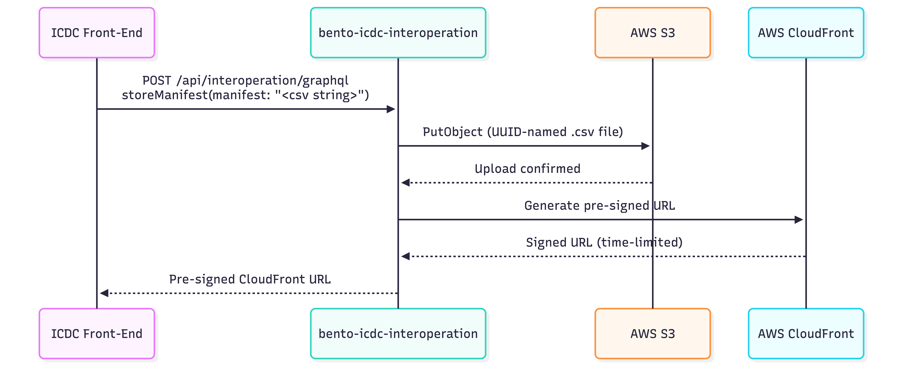

# bento-icdc-interoperation

This microservice provides an API for the ICDC front-end to upload a file manifest to an S3 bucket and receive a pre-signed CloudFront URL that the client can use for integration with the Cancer Genomics Cloud.

&nbsp;

## Process overview



&nbsp;

## Usage

### GraphQL endpoint

`POST /api/interoperation/graphql`

### Example query:

```graphql
{
    storeManifest(manifest: "col1,col2\nval1,val2")
}
```

### Example response:

```json
{
    "data": {
        "storeManifest": "https://d123.cloudfront.net/550e8400-e29b-41d4-a716-446655440000.csv?Policy=...&Signature=...&Key-Pair-Id=..."
    }
}
```

The returned URL is time-limited (controlled by `SIGNED_URL_EXPIRY_SECONDS`) and can be used directly by the client to download the uploaded manifest file.

&nbsp;

## Health endpoints

| Method | Path | Description |
| :----: | :--- | :---------- |
| GET | `/api/interoperation/ping` | Liveness check — returns `pong` |
| GET | `/api/interoperation/version` | Returns service `version` and `date` |

&nbsp;

## Environment variables

| Variable | Description |
| :------- | :---------- |
| `VERSION` | Service version string |
| `DATE` | Service release date |
| `AWS_REGION` | AWS region for the S3 client |
| `S3_ACCESS_KEY_ID` | AWS access key ID for S3 uploads |
| `S3_SECRET_ACCESS_KEY` | AWS secret access key for S3 uploads |
| `FILE_MANIFEST_BUCKET_NAME` | S3 bucket name where manifest files are stored |
| `CLOUDFRONT_KEY_PAIR_ID` | CloudFront key pair ID used to sign URLs |
| `CLOUDFRONT_PRIVATE_KEY` | CloudFront private key used to sign URLs |
| `CLOUDFRONT_DOMAIN` | CloudFront distribution domain (e.g. `https://d123.cloudfront.net`) |
| `SIGNED_URL_EXPIRY_SECONDS` | Lifetime of the generated pre-signed URL in seconds |
